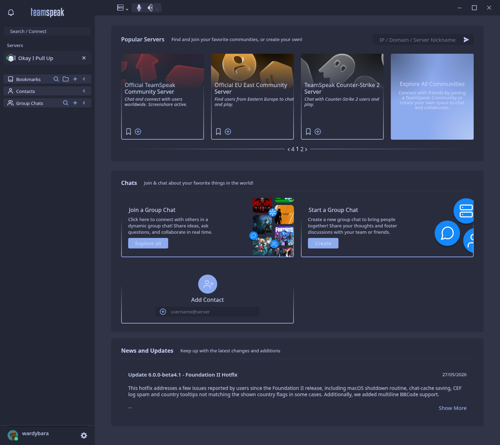
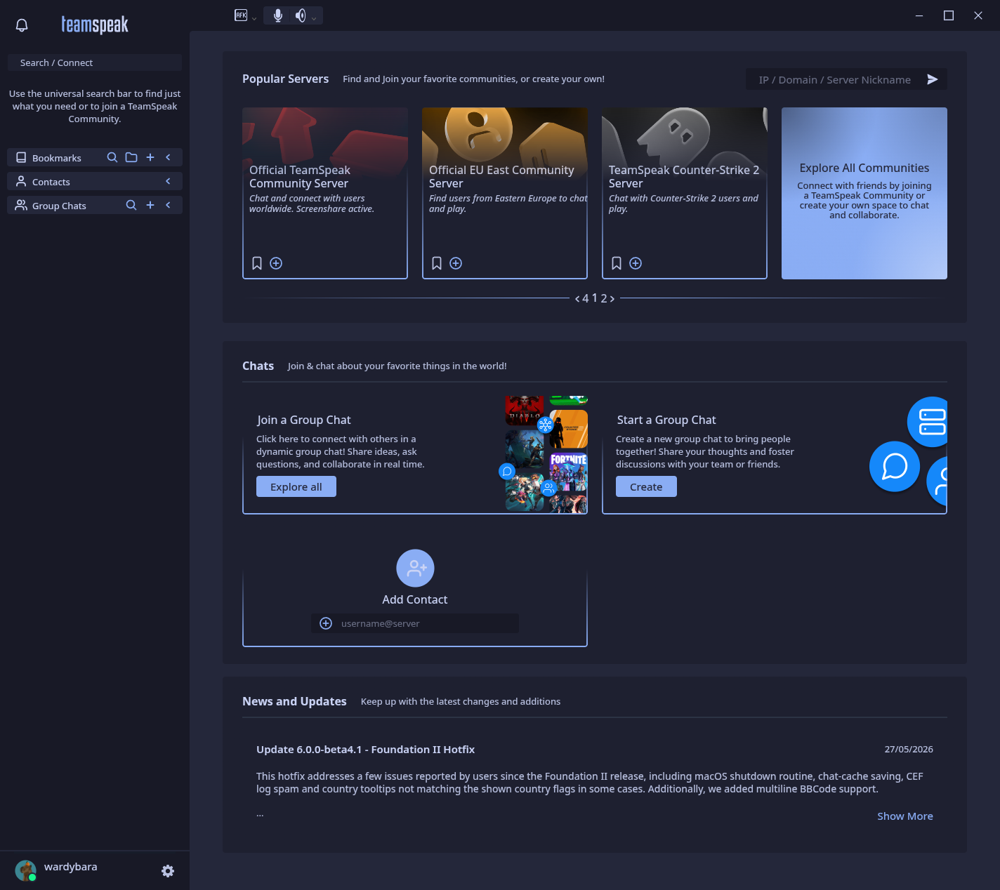
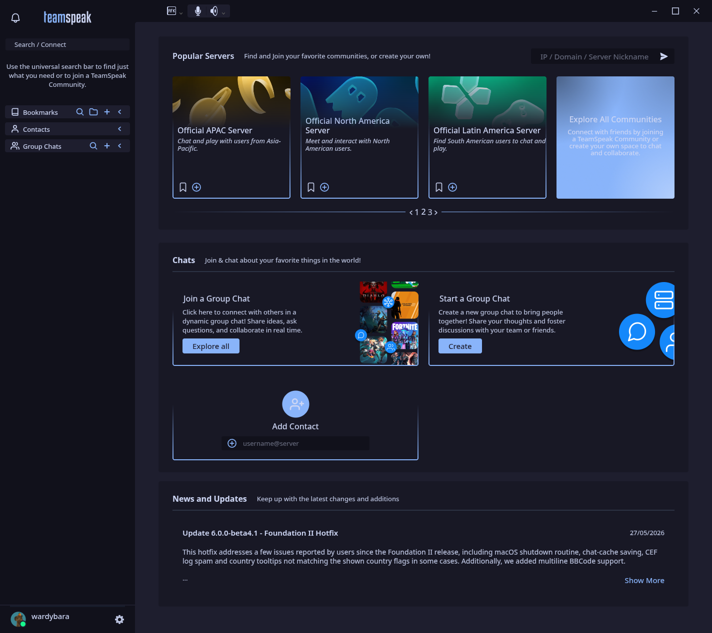

Soothing pastel themes for TeamSpeak 5/6.

A [Catppuccin](https://catppuccin.com) port for TeamSpeak.

## Previews

| Latte                                | Frappé                        |
| ------------------------------------ | ----------------------------- |
|          |  |
| **Macchiato**                        | **Mocha**                     |
|  |   |

## Flavors

For each of the four Catppuccin flavors (`latte`, `frappe`, `macchiato`, `mocha`)
there is a base theme using the `blue` accent plus a variant for each of the
fourteen accents:

| Identifier                          | Flavor    |
| ----------------------------------- | --------- |
| `io.catppuccin.teamspeak.latte`     | Latte     |
| `io.catppuccin.teamspeak.frappe`    | Frappé    |
| `io.catppuccin.teamspeak.macchiato` | Macchiato |
| `io.catppuccin.teamspeak.mocha`     | Mocha     |

Accent variants: `rosewater`, `flamingo`, `pink`, `mauve`, `red`, `maroon`,
`peach`, `yellow`, `green`, `teal`, `sky`, `sapphire`, `blue`, `lavender`.

## Installation

1. Download the flavor folder of your choice from `themes/` (e.g.
   `io.catppuccin.teamspeak.mocha`).
2. Place the folder into your TeamSpeak extensions directory:
   - **Linux (native):** `~/.config/TeamSpeak/Default/extensions/`
   - **Linux (Flatpak):** `~/.var/app/com.teamspeak.TeamSpeak/config/TeamSpeak/Default/extensions/`
   - **Windows:** `%APPDATA%/TeamSpeak/Default/extensions/`
   - **macOS:** `~/Library/Application Support/TeamSpeak/Default/extensions/`
3. Restart TeamSpeak and clear the extension cache if themes don't appear:
   - Delete the contents of `~/.cache/TeamSpeak/Default/` (or the equivalent on your platform)
4. Enable **User Theme** in Settings → Appearance and pick your theme.

## Building

The themes are generated programmatically with PostCSS.

```sh
npm install
npm run build   # writes themes/io.catppuccin.teamspeak.*/
```

Node.js 22+ is required (runs TypeScript natively via type stripping).

## Adding a flavor

The palettes live in `src/palette.ts` and the variable mapping in `src/theme.ts`.
`node src/generate.ts` regenerates every theme manifest and stylesheet.

## License

MIT — see [LICENSE](LICENSE). Portions derived from
[`doa`](https://github.com/ImScheinox/doa) (MIT, © ImScheinox). Palette data
from [catppuccin/palette](https://github.com/catppuccin/palette) (MIT).
